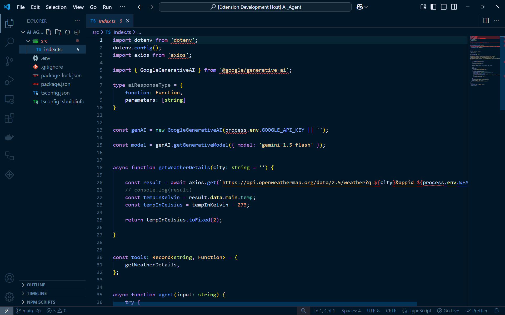
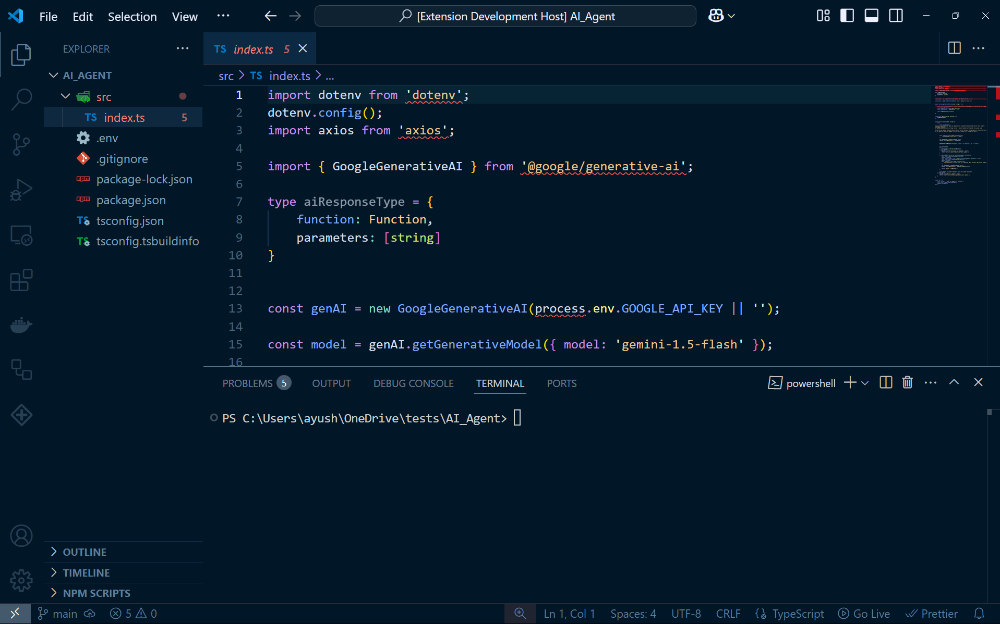

# 3am Code 🌙


[](https://vscode.dev/theme/aayushkarwa.3am-code-by-ak)

A sleek and modern **dark theme** for VS Code, designed for late-night coding sessions. This version of the **3am Code** theme introduces **italicized syntax highlighting** to enhance readability and aesthetics.

## ✨ Features
- **Dark, high-contrast theme** optimized for low-light environments.
- **Italicized keywords, comments, and special syntax** for better emphasis.
- **Enhanced syntax highlighting** for improved readability.
- **Perfect for late-night coding sessions.**

## 📸 Screenshots
### Code Preview


### UI Preview


## 🔧 Installation
### From VS Code Marketplace
1. Open **VS Code**.
2. Go to **Extensions** (`Ctrl+Shift+X`).
3. Search for **"3am Code Dark Italics"**.
4. Click **Install**.
5. Go to **Settings > Color Theme** and select **"3am Code Dark Italics"**.

### Manual Installation
1. Clone this repository:
   ```sh
   git clone https://github.com/AayushKarwa/3am-code
   ```
2. Open VS Code and go to **Extensions**.
3. Click on `...` (More Actions) > **Install from VSIX**.
4. Select the `.vsix` file from the cloned repo.
5. Apply the theme from **Settings > Color Theme**.

## 🔧 Customization
If you'd like to tweak the theme, you can modify the `3am-code-color-theme.json` file in the `themes/` folder.

## 🛠 Extension Details
- **Name:** 3am-code-by-ak
- **Display Name:** 3am Code
- **Description:** A perfect theme for late night coding sessions.
- **Publisher:** AayushKarwa
- **Repository:** [GitHub](https://github.com/AayushKarwa/3am-code)
- **Version:** 0.0.8
- **License:** MIT

## 📢 Feedback & Contributions
- Found a bug or want to suggest a feature? Open an [issue](https://github.com/AayushKarwa/3am-code/issues).
- Feel free to **fork** and contribute!

## 📜 License
This theme is open-source under the [MIT License](LICENSE). Enjoy coding at **3AM**! 🚀

